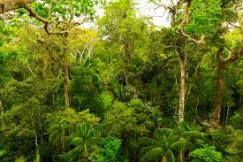
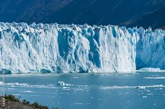

# Landscape
## Dataset
This is a DNN trained to categorize landscapes into on of five classes (Coast, Desert, Forest, Glacier and Mountains). It is trained on the publically available dataset from [Kaggle](https://www.kaggle.com/datasets/utkarshsaxenadn/landscape-recognition-image-dataset-12k-images). Example images from the dataset look like this

| Coast  | Desert  |  Forest | Glacier  | Mountain |
|---|---|---|---|---|
|   |   |   |   |   |

Images come at random sizes but with an equal class distribution. There are 2000 training images and 300 validation images per class in the dataset. 
## Data augmentation
The training set is augmented on-the-fly by applying random image transformations to the samples. Images are resized, randomly rotated (+/-10°), randomly flipped and randomly cropped. Color jitter is applied as well. 

    self.transform = torchvision.transforms.Compose([
            torchvision.transforms.RandomRotation(
              degrees=(-10,10), 
              interpolation=torchvision.transforms.InterpolationMode.BILINEAR),
            torchvision.transforms.CenterCrop((282,282)),
            torchvision.transforms.RandomCrop((256,256)),
            torchvision.transforms.RandomHorizontalFlip(),
            torchvision.transforms.ColorJitter(brightness=0.05, hue=0.05),
          ])

## Network
The network is a classic convolutional neural network with max-pooling and batch normalization layers plus a three-layer fully-connected part at the end. The network has ~14M learnable parameters.

    self.relu = torch.nn.GELU()
        
    self.conv1 = torch.nn.Conv2d(3, 16, kernel_size=(5,5), padding="same")
    self.pool1 = torch.nn.MaxPool2d(kernel_size=(2,2), stride=(2,2))
    self.bn1 = torch.nn.BatchNorm2d(num_features=16)

    self.conv2 = torch.nn.Conv2d(16, 32, kernel_size=(5,5), padding="same")
    self.pool2 = torch.nn.MaxPool2d(kernel_size=(2,2), stride=(2,2))
    self.bn2 = torch.nn.BatchNorm2d(num_features=32)

    self.conv3 = torch.nn.Conv2d(32, 64, kernel_size=(5,5), padding="same")
    self.pool3 = torch.nn.MaxPool2d(kernel_size=(2,2), stride=(2,2))
    self.bn3 = torch.nn.BatchNorm2d(num_features=64)

    self.conv4 = torch.nn.Conv2d(64, 128, kernel_size=(5,5), padding="same")
    self.pool4 = torch.nn.MaxPool2d(kernel_size=(2,2), stride=(2,2))
    self.bn4 = torch.nn.BatchNorm2d(num_features=128)

    self.conv5 = torch.nn.Conv2d(128, 256, kernel_size=(5,5), padding="same")
    self.pool5 = torch.nn.MaxPool2d(kernel_size=(2,2), stride=(2,2))
    self.bn5 = torch.nn.BatchNorm2d(num_features=256)

    self.conv6 = torch.nn.Conv2d(256, 256, kernel_size=(5,5), padding="same")
    self.pool6 = torch.nn.MaxPool2d(kernel_size=(2,2), stride=(2,2))
    self.bn6 = torch.nn.BatchNorm2d(num_features=256)
    
    self.linear1 = torch.nn.Linear(4096, 2048)
    self.dropout1 = torch.nn.Dropout(p=0.5)
    self.linear2 = torch.nn.Linear(2048, 1024)
    self.dropout2 = torch.nn.Dropout(p=0.5)
    self.linear3 = torch.nn.Linear(1024, 512)
    self.dropout3 = torch.nn.Dropout(p=0.5)
    self.linear4 = torch.nn.Linear(512, 5)

## Training
The network is heavily regularized with dropout layers on the three final layers plus minimal weight decay on the optimizer (ADAM). The network achieves 90% accuracy on the training and 80% accuracy on the validation set. 

## About the Author
I am a passionate developer with a professional AI/ML background. This is a toy example that can be a starting point for future improvements.